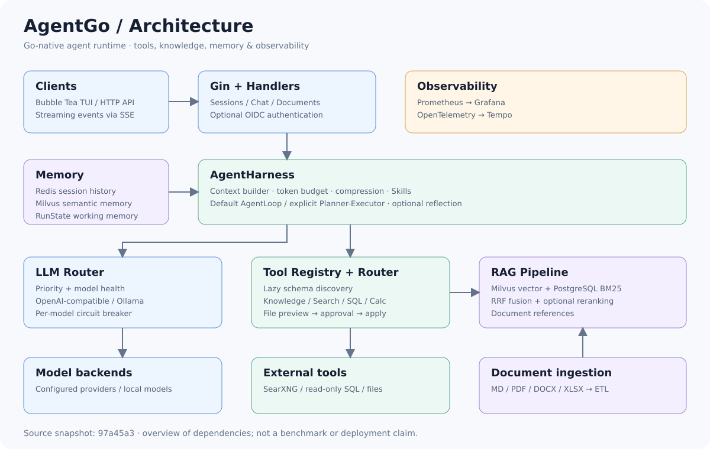
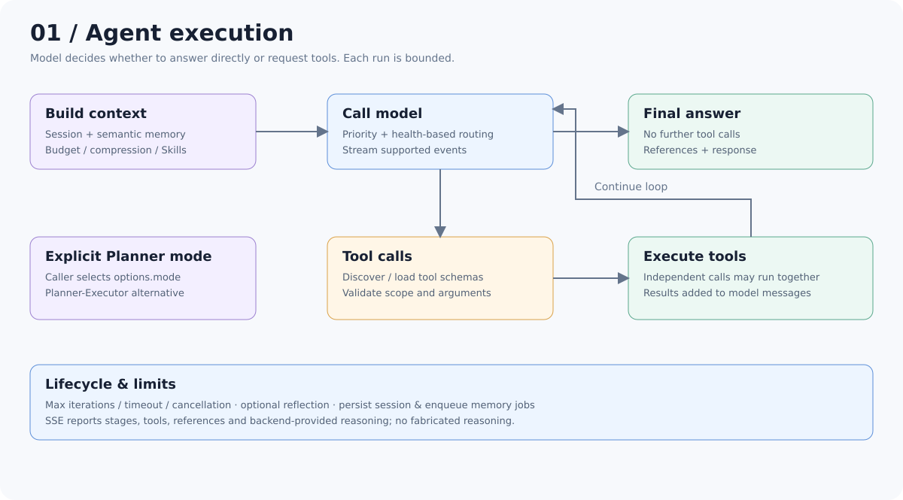
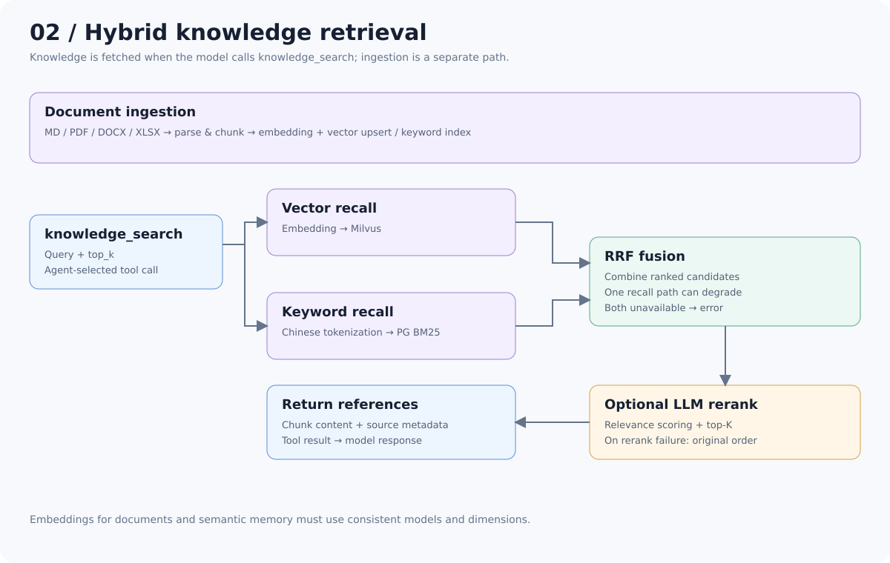

# AgentGo 架构与源码导航

依据 `97a45a3` 源码整理。SVG 为可直接在 GitHub 展示的静态图，不依赖外部图床。

## 总体架构

Gin Handler 接收请求，AgentHarness 构建上下文并管理单次执行。默认模式进入 AgentLoop；Planner 模式由调用方显式选择。工具调用连接知识、搜索、数据库和本地文件；记忆和观测贯穿生命周期。

## Agent 执行

模型可以直接输出答案，也可以返回工具调用。工具发现与业务工具执行均受 scope 和调用限制约束。文件修改需要先生成 diff 与 proposal，再由调用方显式批准。

## RAG 检索

默认双路召回、RRF 融合、可选重排序。一路召回失败时尝试保留另一条结果；重排序调用或解析失败时保留原始排序。文档与长期记忆的 embedding 模型和维度应一致。

## 源码导航

| 模块 | 入口 | 关注点 |
| --- | --- | --- |
| 请求路由 | [router.go](../internal/router/router.go) | HTTP 路由与鉴权 |
| 生命周期 | [harness.go](../internal/harness/harness.go) | 上下文、执行模式、Hook、会话与记忆任务 |
| Agent 循环 | [loop.go](../internal/agentloop/loop.go) | 模型决策、工具调用、迭代限制 |
| 上下文 | [builder.go](../internal/agentcontext/builder.go) | 会话与语义记忆、预算与压缩 |
| 模型路由 | [router.go](../internal/llm/router.go) | 指定模型、优先级、健康状态与熔断 |
| 工具注册 | [registry.go](../internal/tool/registry.go) | 工具发现与 Schema 惰性加载 |
| 检索流水线 | [pipeline.go](../internal/rag/pipeline.go) | 检索、可选重排序与 top-K |
| 混合召回 | [retriever.go](../internal/rag/retriever.go) | Milvus、BM25、RRF 与降级 |
| 重排序 | [reranker.go](../internal/rag/reranker.go) | 相关性评分与失败回退 |
| 文件审批 | [filesystem.go](../internal/tool/builtin/filesystem.go) | diff、proposal、哈希校验与原子替换 |

## 边界

- OIDC 默认关闭，本地请求共享 `local-user`；多人或公网部署需启用鉴权。
- 文件工具的权限边界是服务进程的操作系统权限。
- TUI 仅展示模型后端提供的显式 reasoning，不生成模拟推理。
- 性能与效果以 [Benchmark 结果](BENCHMARK_RESULTS.md) 的环境与测量条件为准。
